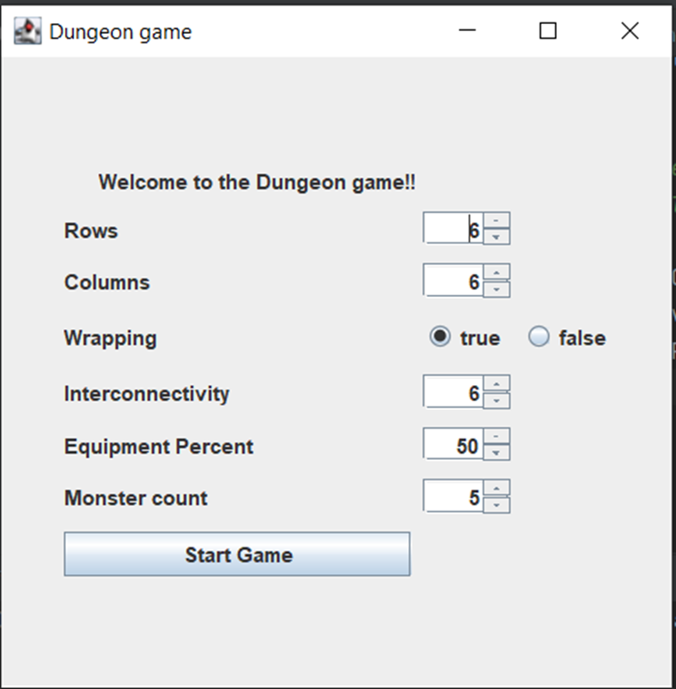
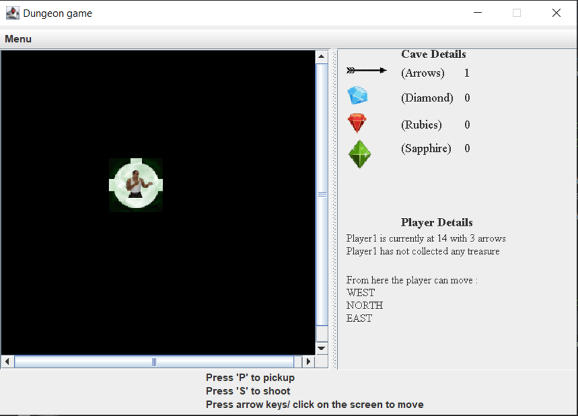
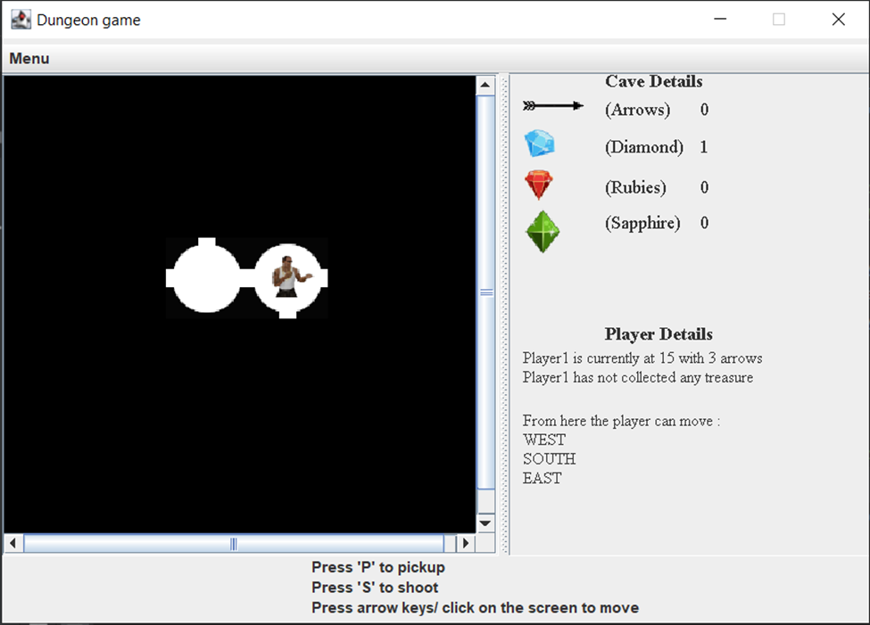
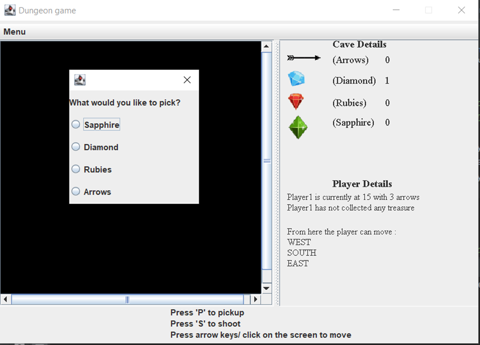
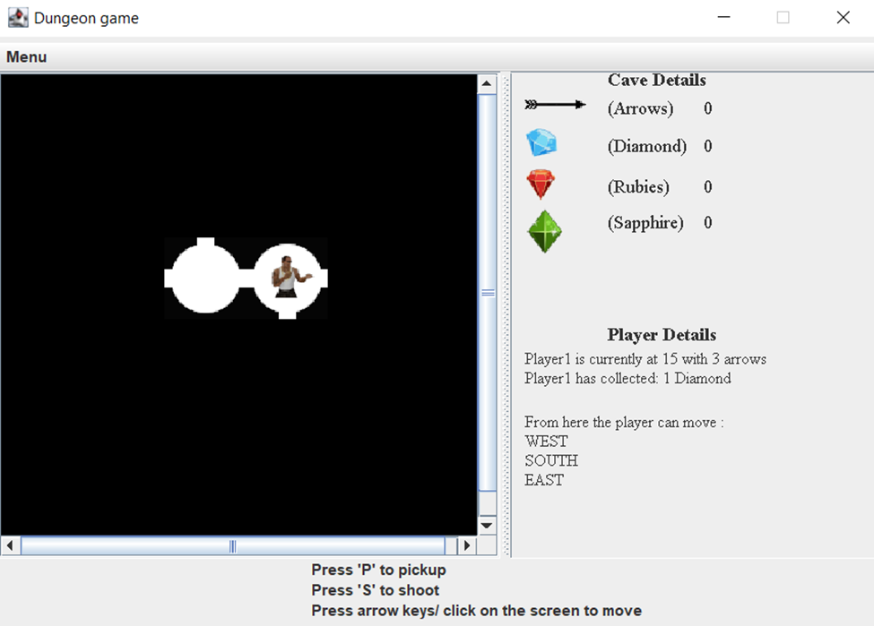
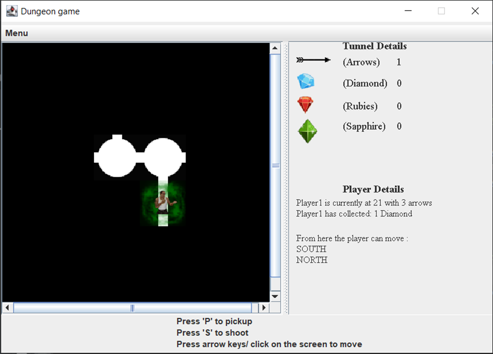
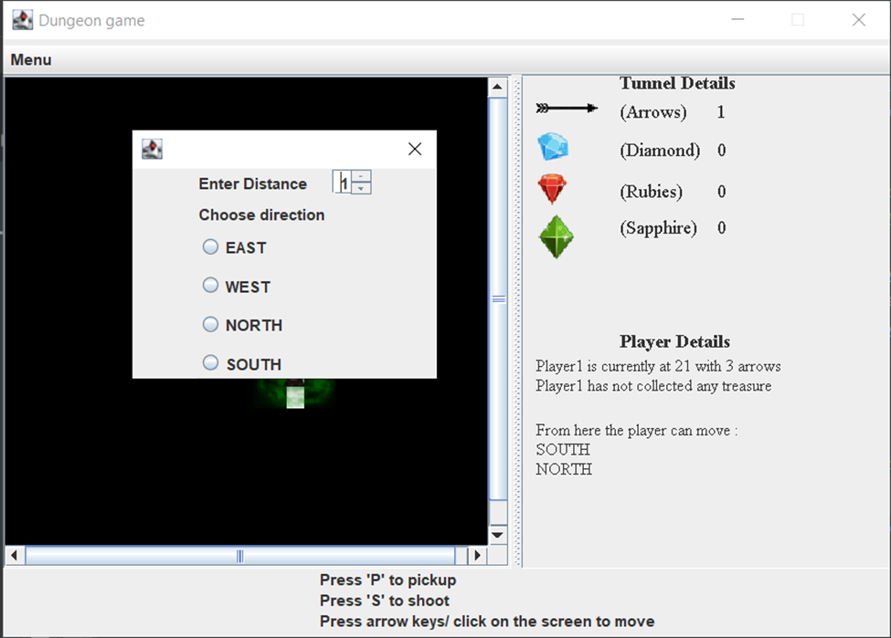
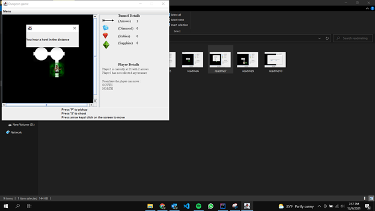
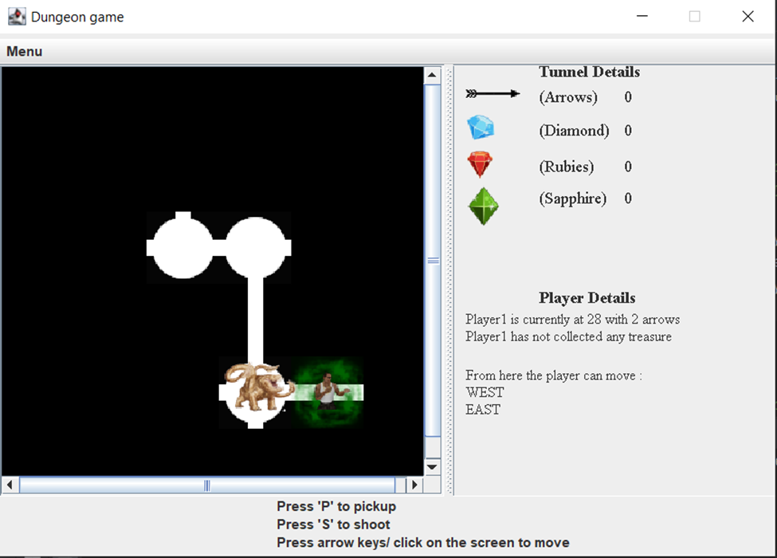
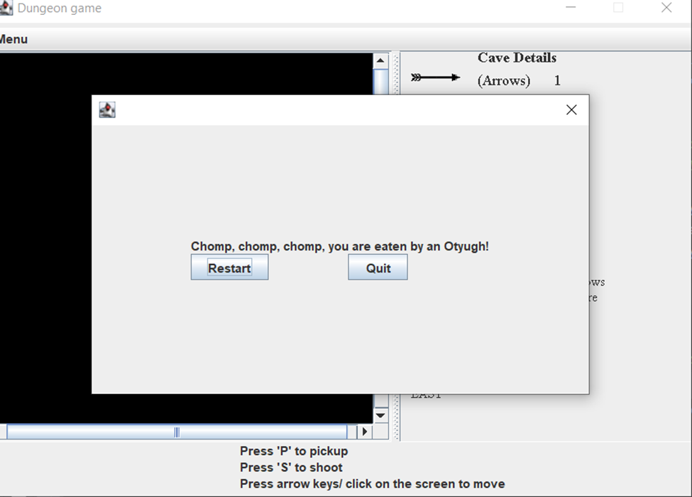

# Maze runner

## About: 
This project is about a "Dungeon", which is basically a network of tunnels and caves that are interconnected so that player can explore the entire dungeon by traveling from cave to cave via tunnels.

A cave is subjected to have either 1 or more than 2 exits and can contain treasure as well as arrows, whereas a tunnel has 2 exits and contain only arrows. The exits can be in 4 directions : North, South, East, West.
 
Cave might have a monster in it and has the potential to kill the player.

User of the game has the ability to assign treasure to the caves of the dungeon. So when the player reaches a particular cave having treasure, he can pick the treasure.
Player can collect and shoot arrows to either damage or kill the monster.

Player starts from the start cave and once he reaches the end cave or gets killed by the monster, the game ends.


## List of features:
#### The project contains features:
-   Create a dungeon having tunnels and caves based on user input of rows, tunnels, degree of interconnectivity and wrapping.
-   Assign treasure to the caves.
-   Assign arrows to the caves and tunnels.
-   Spread monsters in the caves.
-   Assign start and end caves.
-   Move player to the start cave when game begins.
-   Move player to different caves based on user input of directions.
-   Player collects treasure and arrows wherever available.
-   Player can shoot arrow to either damage or kill the monster.
-   Player reaches the end cave and game stops.

## How to Use the Program:
-   Navigate to the res directory and check for Project2.jar file
-   Run the following command by passing inputs for rows, columns, interconnectivity, wrapping, equipment count and monster count:
```Shell
java -jar <location of jar file>
```
- The above code runs GUI based game.
```Shell
java -jar <location of jar file> rows(1 - 100) columns(1 - 100) interconnectivity(0 - rows * columns) wrapping(true/false) equipments(0 - 100) monsters(0 - rows * columns)
```
- The above code runs console based game.
-   Example: java -jar <location of jar file> 5 5 5 true 50 8
-   The above command corresponds to 5 rows, 5 columns, 5 degree of interconnectivity, wrapping, 50 equipment count and 8 monsters.

## Description of Examples:
To demonstrate the example of the driver program, a run file is provided which contains the output.
The output displays:

1. Configuration screen to setup game.
   
   

2. Game start with the player at start cave.
   The cave and player details displayed on the right and instructions at the bottom.
   
   

3. Player moved to the next location. Details on the right are updated.
   
   

4. Pickup treasure dialog.
   
   

5. Treasure collected, the stats panel on the right updated.
    
   

6. Smell detected
    
   

7. Shoot dialog to insert distance and direction.
    
   

8. Monster damaged due to arrow hit.
    
   

9. Player surpassed damaged monster.
    
   

10. Player killed by the monster and game ends.
    

### Assumptions:
-   Dungeon should be atleast 5 x 5.

### Citations: 
-  Wikimedia Foundation. (2021, April 25). Kruskal's algorithm. Wikipedia. Retrieved November 1, 2021, from https://en.wikipedia.org/wiki/Kruskal%27s_algorithm. 

-  Disjoint set (or Union-Find): Set 1 (detect cycle in an undirected graph). GeeksforGeeks. (2021, July 5). Retrieved November 1, 2021, from https://www.geeksforgeeks.org/union-find/. 

-  Docs.oracle.com. 2021. Trail: Creating a GUI With Swing (The Java™ Tutorials). [online] Available at: <https://docs.oracle.com/javase/tutorial/uiswing/> [Accessed 4 December 2021].

-  Docs.oracle.com. 2021. How to Use GridBagLayout (The Java™ Tutorials > Creating a GUI With Swing > Laying Out Components Within a Container). [online] Available at: <https://docs.oracle.com/javase/tutorial/uiswing/layout/gridbag.html> [Accessed 5 December 2021].

-  Listeners, H., 2021. How to use Key Bindings instead of Key Listeners. [online] Stack Overflow. Available at: <https://stackoverflow.com/questions/22741215/how-to-use-key-bindings-instead-of-key-listeners> [Accessed 6 December 2021].


